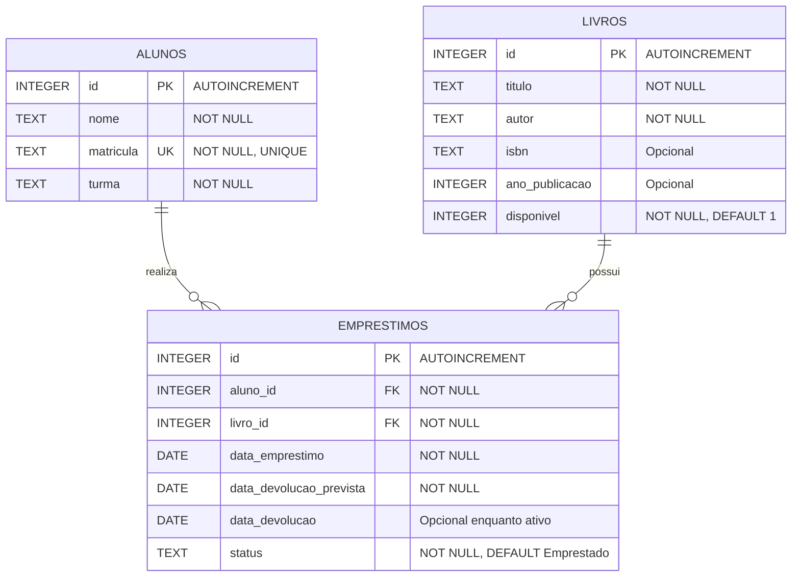

# Diagrama Entidade-Relacionamento

- Um aluno realiza **zero ou muitos empréstimos**. Cada empréstimo pertence a **exatamente um aluno**.
- Um livro possui **zero ou muitos empréstimos ao longo do tempo**. Cada empréstimo refere-se a **exatamente um livro**.
- Cada registro de livro representa **um exemplar físico**. Exemplares do mesmo título podem ter o mesmo ISBN; por isso ISBN não é UNIQUE.
- `aluno_id` referencia `alunos.id`; `livro_id` referencia `livros.id`.
- Não há cópias do nome do aluno ou título do livro em empréstimos: as consultas usam JOIN.
- Um índice UNIQUE parcial permite apenas um empréstimo com status `Emprestado` por livro.
- As FKs usam `ON DELETE RESTRICT`: nem mesmo o histórico devolvido é apagado por exclusão de aluno ou livro.

O Mermaid pode ser visualizado em leitores Markdown compatíveis. A definição SQL completa está em [schema.sql](schema.sql).
